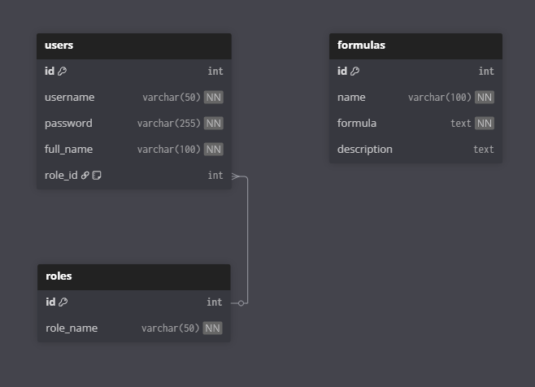

# 1. A rendszer célja
Az elsődleges cél, hogy egy alap számológépként működjön, lehetőségek szerint minél több elemet tartalmazva egy tudományos számológépből. Az egész lényege, hogy egy olyan számológépet hozzunk létre, amely a lehető legkényelmesebb használatot biztosítja, és a gyakran felmerükő problémákra fókuszál.

## Ideális működés 
Ideális esetben a rendszer tartalmaz minden problémára megoldást, és segítséget nyújt a gyakorlati helyzetek kivitelezésében.

## 2. Projekt terv

| Funkció                     | Feladat                                   |
| ----------------------------| ------------------------------------------|
| Köv. spec                   | A megrendelő dokumentációja               |       
| Funk. spec                  | A fejlesztő csapat dokumentációja         |       
| Rendszerterv                | A rendszer átfogó dokumentációja          |      
| Adattárolás                 | Adatbázis megvalósítása                   |      
| Regisztrációs felület       | Regisztráció frontend/backend             |      
| Bejelentkezési felület      | Bejelentkezés frontend/backend            |       
| Főoldal                     |                                           |
| Design                      | css/javascript                            |

## Felhasználói modell

## 3.Rendszer architektúra
A számológép alkalmazás háromrétegű modell alapján épül fel, amely biztosítja az átláthatóságot és a bővíthetőséget.
Az első réteg a prezentációs réteg (UI), amely felelős a felhasználói interakcióért. Ide tartozik a gombok elrendezése, a kijelző, valamint a vizuális megjelenés, amit HTML és CSS valósít meg.

A második réteg a logikai réteg (számítások). Ez a rész kezeli a felhasználó által bevitt adatok feldolgozását, a műveletek elvégzését, valamint az eredmények előállítását. Itt JavaScript függvények végzik a számításokat.

A harmadik réteg az adatkezelési réteg, amely az előzmények kezelésére szolgál. Ez a böngésző LocalStorage funkcióját használja, így a műveletek és eredmények ideiglenesen megőrizhetők.
Ez a rétegelt felépítés biztosítja, hogy a felhasználói felület független legyen a számítási logikától, és az adatkezelés külön kezelhető legyen. A struktúra előnye, hogy a rendszer egyszerűen karbantartható, és a jövőben könnyen bővíthető további funkciókkal.

## 4. Felhasználói felület
A számológép felülete letisztult és könnyen használható, a felhasználóbarát működést tartja szem előtt.

Számgombok: (0–9)
A fő számbevitel a gombok megnyomásával történik. Ezeket rácsszerűen helyezzük el (3×3 + 0).

Műveleti gombok: (+, −, ×, ÷)
Külön oszlopban kapnak helyet, hogy jól elkülönüljenek a számoktól.

Speciális gombok:

% → százalékszámításhoz

√ → négyzetgyök

x² → négyzetre emelés

Törlő gombok

C → az aktuális bevitt szám törlése

AC → minden adat törlése (kijelző + előzmények)

Nagy kijelzőmező:
A legfelső részen található, ide kerül az aktuálisan bevitt szám és a művelet jele.
Példa: 23 + vagy 12 ÷ 3 = 4.

Másodlagos kijelző az előzményekhez
A fő kijelző alatt jelennek meg az utolsó műveletek.
Példa:
5 + 7 = 12
12 × 3 = 36

## 5. Adatkezelés 
A számológép egyszerű adatkezelést valósít meg, főként a képletek tárolására.

Tárolás módja:
A böngésző LocalStorage funkcióját használjuka  a felhasználó kezelésre .
A felhasználó elérheti az adatbázisban tárolt képleteket.

Törlés:
A felhasználó AC gombbal törölheti a teljes előzményt.
C csak az aktuális számot törli.

Tárolt formátum:
Minden művelet szöveges formában kerül tárolásra:
Példa: "12 + 8 = 20"

## Adatkezelési folyamat:
 [Felhasználói bevitel] --->[Számítási modul] ---> [Eredmény kijelző]---> [Előzmények lista]---> [LocalStorage böngészőben]
 ### Adatrétég (Adatkezelési réteg):
- **Technológia**: MySQL (regisztrált)
  - Képletek mentése
  - Felhasználói beállítások
  - Munkamenet kezelés

 Adatbázis terv

6. Követelmények

 Funkcionális követelmények:

- Regisztráció/Bejelentkezés**: A felhasználók létrehozhatnak egy fiókot, és bejelentkezhetnek a rendszerbe
- Alap műveletek**: Összeadás, kivonás, szorzás, osztás
- Tudományos műveletek**: 
  - Hatványozás (x², x³, xʸ)
  - Gyökvonás (√, ∛)
  - Trigonometrikus függvények (sin, cos, tan)
  - Logaritmus (log, ln)
  - Faktoriális
  - Százalékszámítás
- **Képletek mentése**: Gyakran használt képletek elmentése és betöltése
- **Törlési funkciók**: C (aktuális)

## Nem funkcionális követelmények:
- **Teljesítmény**: Azonnali válaszidő számításoknál
- **Használhatóság**: Intuitív, egyszerű felhasználói felület
- **Megbízhatóság**: Pontos számítási eredmények
- **Hordozhatóság**: Böngészőfüggetlen működés
- **Reszponzivitás**: Mobilbarát megjelenés

# 7. Funkcionális terv 

## Rendszerszereplők:
- **Regisztrált felhasználó**
- **Adminisztrátor**
-Moderátor
## Rendszerhasználati esetek és lefutásaik:

**Regisztrált felhasználó**:
- Képletek mentése

**Admin**:
- Felhasználók kezelése
- Minden adat módosítása 
-Felhasználók kezelése

## Menü-hierarchiák:
- **FŐMENÜ**
    - Bejelentkezés
    - Regisztráció
- **BEJELENTKEZÉS**
    - Regisztráció
    - Főmenü
- **REGISZTRÁCIÓ**
    - Bejelentkezés
    - Főmenü
- **SZÁMOLÓGÉP FELÜLET**
    - Alap műveletek
    - Tudományos műveletek
    - Mentett képletek (csak bejelentkezett)

# 8. Fizikai Környezet

A rendszer webes környezetben fut és minden modern böngészőben reszponzívnak készül el.

**Támogatott böngészők:**
- Google Chrome (90+)
- Mozilla Firefox (88+)
- Microsoft Edge (90+)
- Safari (14+)
- Opera (76+)

**Eszközök:**
- Asztali számítógépek

# 9. Fejlesztői eszközök:

- **Visual Studio Code** - kódszerkesztő
- **Git & GitHub** - verziókezelés
- **XAMPP** - lokális szerver környezet
- **Postman** - API tesztelés
- **Chrome DevTools** - böngésző alapú debuggolás
- **Trello** - projekt menedzsment
- **Discord** - csapatkommunikáció

# 10. Architekturális terv

A számológép alkalmazás háromrétegű modell alapján épül fel, amely biztosítja az átláthatóságot és a bővíthetőséget.

## Rétegek:

### 1. Kliensréteg (Frontend - Prezentációs réteg):
- **Technológia**: HTML5, CSS3, JavaScript 
- **Felelősség**: 
  - Felhasználói felület megjelenítése
  - Gombok elrendezése és interakciók kezelése
  - Kijelző frissítése
  - Reszponzív design
- **Komponensek**:
  - Display komponens
  - Button grid

## Logikai réteg
  - Matematikai műveletek végrehajtása
  - Input validálás
  - Hiba kezelés
  - Képletek kiértékelése
- **Modulok**:
  - Számítási motor
  - Kifejezés feldolgozó (parser)
  - Trigonometrikus függvények
  - Logaritmus számítások

# 11. Tesztterv

## Unit tesztek:
- Matematikai műveletek pontossága
- Hiba kezelés

## Integrációs tesztek:
- Adatbázis műveletek
- Frontend-Backend kommunikáció

## UI tesztek:
- Reszponzív megjelenés
- Gomb interakciók
- Navigáció

## Teljesítmény tesztek:
- Számítási sebesség
- Nagy számok kezelése

# 12. Karbantartási terv

## Rendszeres feladatok:
- Biztonsági frissítések alkalmazása
- Adatbázis optimalizálás
- Log fájlok tisztítása
- Biztonsági mentések készítése

## Fejlesztések:
- Új matematikai funkciók hozzáadása
- UI/UX fejlesztések

# 14. Használt technológiák

A projekt megvalósításához a következő technológiákat és eszközöket használjuk:

## Frontend technológiák:
- **HTML5**: Alapvető struktúra és markup
- **CSS3**: Stíluslapok, reszponzív design
- **JavaScript (ES6+)**: Kliens oldali logika, számítások

## Backend technológiák (regisztrált felhasználókhoz):
- **MySQL**: Relációs adatbázis felhasználói adatok tárolására

## Adattárolás:
- **MySQL**: Regisztrált felhasználók adatbázisa

## Fejlesztői eszközök:
- **Visual Studio Code**: Kódszerkesztő
- **Git & GitHub**: Verziókezelés és együttműködés
- **XAMPP**: Lokális fejlesztői környezet (Apache, MySQL, PHP)
- **Chrome DevTools**: Frontend hibakeresés és tesztelés

## Projektmenedzsment és kommunikáció:
- **Trello**: Feladatok követése, sprint planning, Kanban tábla
- **Discord**: Csapatkommunikáció, daily standup, kódmegosztás
